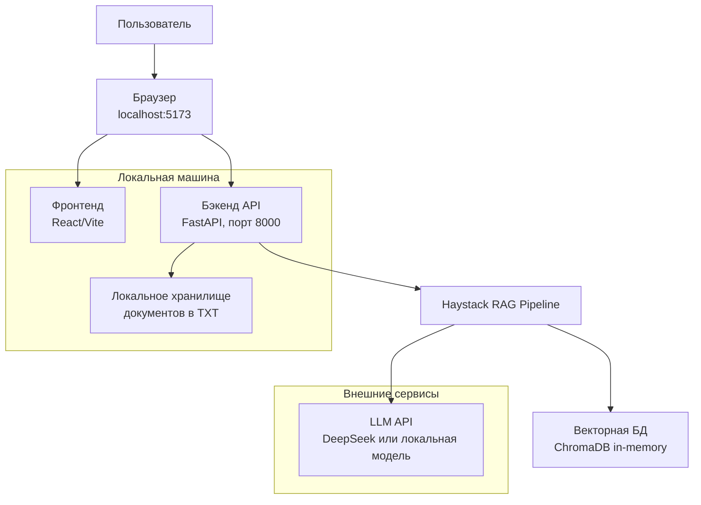

# Техническое задание: Веб-платформа СРО НОСО с Haystack (локальный запуск)

## Цель проекта
Создать минимальную веб-платформу для доступа к документам СРО НОСО с ИИ-консультантом на базе Haystack, предназначенную для полностью локального запуска без внешних зависимостей.

## Архитектура решения



## Основной функционал

### 1. Каталог документов (/documents)
- **Хранение документов**: Локальные текстовые файлы в папке `backend/documents`
- **Доступ**: Открытый для всех пользователей
- **Поиск**: Клиентский поиск по названиям документов
- **Просмотр**: Текстовое представление документов
- **Организация**: Документы сгруппированы по категориям

### 2. ИИ-консультант (/chat)
- **Технология**: RAG-система на базе Haystack
- **База знаний**: Локальные текстовые документы
- **Функции**: Контекстные ответы на русском языке

## Технический стек

### Фронтенд
- **Фреймворк**: React 18 + TypeScript
- **Сборка**: Vite 5
- **Стили**: Tailwind CSS 3.4
- **Запуск**: Локальный сервер разработки (localhost:5173)

### Бэкенд
- **Фреймворк**: FastAPI (Python)
- **RAG система**: Haystack 2.x
- **Векторная БД**: Chroma DB (в памяти)
- **LLM**: DeepSeek API (требуется API ключ) или локальная модель
- **Запуск**: Локальный сервер (localhost:8000)

## Требования к системе

### Программное обеспечение
- Python 3.11+
- Node.js 16+
- npm или yarn

### Аппаратные требования
- Оперативная память: 8 ГБ+ (рекомендуется 16 ГБ для работы с локальными моделями)
- Свободное место на диске: 5 ГБ+
- Интернет-соединение: Требуется только для установки зависимостей и использования API DeepSeek

## Структура проекта

```
noso-webapp_local_demo/
├── backend/                 # FastAPI приложение
│   ├── app/
│   │   ├── main.py         # Основное приложение FastAPI
│   │   ├── haystack_setup.py # Настройка Haystack
│   │   ├── models.py       # Модели данных
│   │   └── documents/      # Текстовые версии документов
│   ├── requirements.txt    # Python зависимости
│   └── README.md          # Инструкции по запуску
├── frontend/              # React приложение
│   ├── src/
│   │   ├── components/    # Компоненты React
│   │   ├── pages/        # Страницы приложения
│   │   └── App.tsx       # Основной компонент
│   ├── package.json      # Node.js зависимости
│   └── index.html
└── docs/                 # Документация
    ├── setup-guide.md    # Руководство по установке
    └── user-guide.md     # Руководство пользователя
```

## Установка и запуск

### 1. Подготовка окружения

```bash
# Клонирование репозитория
git clone <repository-url>
cd sro-platform-local

# Установка зависимостей бэкенда
cd backend
python -m venv venv
source venv/bin/activate  # Linux/Mac
# или venv\Scripts\activate  # Windows
pip install -r requirements.txt

# Установка зависимостей фронтенда
cd ../frontend
npm install
```

### 2. Подготовка документов

- Разместить текстовые файлы документов в папке `backend/app/documents/`
- Создать файл метаданных `backend/app/documents/metadata.json`

Пример структуры metadata.json:
```json
[
  {
    "id": 1,
    "title": "Устав СРО НОСО",
    "category": "Нормативные документы",
    "filename": "charter.txt",
    "description": "Основной уставный документ организации"
  }
]
```

### 3. Настройка API ключей (опционально)

Создать файл `.env` в папке backend:
```
DEEPSEEK_API_KEY=your_api_key_here
```

### 4. Запуск приложения

```bash
# Запуск бэкенда (в отдельном терминале)
cd backend
source venv/bin/activate
uvicorn app.main:app --reload --host 0.0.0.0 --port 8000

# Запуск фронтенда (в другом терминале)
cd frontend
npm run dev
```

### 5. Доступ к приложению

- Фронтенд: http://localhost:5173
- Бэкенд API: http://localhost:8000
- Документация API: http://localhost:8000/docs

## Режимы работы

### 1. Режим с использованием DeepSeek API (требует API ключ)
- Высокое качество ответов
- Требуется интернет-соединение
- Лимиты использования API

### 2. Локальный режим с предзаписанными ответами
- Полностью автономная работа
- Ограниченный набор ответов
- Не требует интернет-соединения

## Ключевые компоненты реализации

### Бэкенд (FastAPI + Haystack)

```python
# backend/app/main.py
from fastapi import FastAPI
from fastapi.middleware.cors import CORSMiddleware
from haystack_setup import setup_haystack

app = FastAPI()

# Настройка CORS для локальной разработки
app.add_middleware(
    CORSMiddleware,
    allow_origins=["http://localhost:5173"],
    allow_credentials=True,
    allow_methods=["*"],
    allow_headers=["*"],
)

# Инициализация Haystack при запуске
haystack_pipeline = setup_haystack()

@app.post("/api/chat")
async def chat_endpoint(query: dict):
    try:
        result = haystack_pipeline.run(query=query["message"])
        return {"answer": result["answers"][0].answer}
    except Exception as e:
        return {"error": str(e)}

@app.get("/api/documents")
async def get_documents():
    # Чтение метаданных документов
    with open("app/documents/metadata.json", "r") as f:
        documents = json.load(f)
    return documents

@app.get("/api/documents/{doc_id}")
async def get_document_content(doc_id: int):
    # Поиск документа по ID
    with open("app/documents/metadata.json", "r") as f:
        documents = json.load(f)
    
    doc_info = next((doc for doc in documents if doc["id"] == doc_id), None)
    if not doc_info:
        return {"error": "Document not found"}
    
    # Чтение содержимого документа
    with open(f"app/documents/{doc_info['filename']}", "r", encoding="utf-8") as f:
        content = f.read()
    
    return {"content": content, "metadata": doc_info}
```

### Фронтенд (React + TypeScript)

```tsx
// frontend/src/pages/ChatPage.tsx
function ChatPage() {
  const [message, setMessage] = useState("");
  const [conversation, setConversation] = useState<Array<{role: string, content: string}>>([]);

  const sendMessage = async () => {
    try {
      const response = await fetch("http://localhost:8000/api/chat", {
        method: "POST",
        headers: { "Content-Type": "application/json" },
        body: JSON.stringify({ message })
      });
      
      const data = await response.json();
      setConversation([
        ...conversation,
        { role: "user", content: message },
        { role: "assistant", content: data.answer }
      ]);
      setMessage("");
    } catch (error) {
      console.error("Ошибка при отправке сообщения:", error);
    }
  };

  return (
    <div className="chat-container">
      <div className="messages">
        {conversation.map((msg, i) => (
          <div key={i} className={`message ${msg.role}`}>
            {msg.content}
          </div>
        ))}
      </div>
      <div className="input-area">
        <input 
          value={message} 
          onChange={(e) => setMessage(e.target.value)}
          placeholder="Задайте вопрос о документах СРО..."
          onKeyPress={(e) => e.key === 'Enter' && sendMessage()}
        />
        <button onClick={sendMessage}>Отправить</button>
      </div>
    </div>
  );
}
```

## Преимущества локального запуска

1. **Конфиденциальность**: Данные не покидают локальную машину
2. **Независимость**: Работа без интернет-соединения (в локальном режиме)
3. **Быстрая разработка**: Мгновенная обратная связь при изменениях кода
4. **Простота отладки**: Легкий доступ к логам и отладка компонентов
5. **Нет затрат**: Не требует оплаты внешних сервисов

## Ограничения

1. **Производительность**: Ограничена ресурсами локальной машины
2. **Качество ответов**: Локальный режим имеет ограниченный набор ответов
3. **Сложность настройки**: Требуется установка и настройка окружения
4. **Масштабируемость**: Предназначено только для демонстрационных целей

Это решение обеспечивает полностью локальную версию платформы, идеальную для демонстрации и тестирования без зависимости от внешних сервисов.
